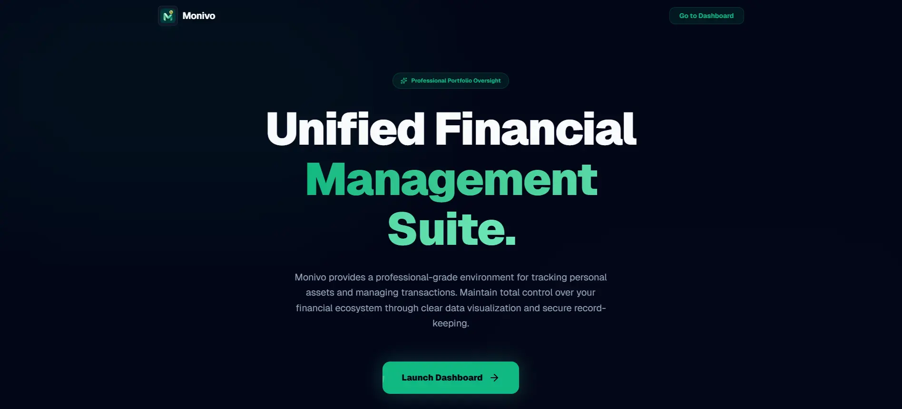
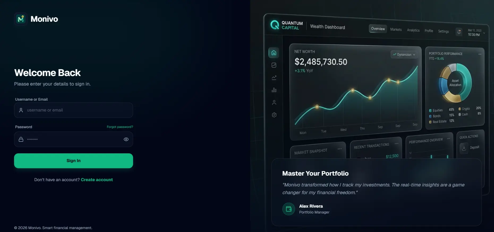
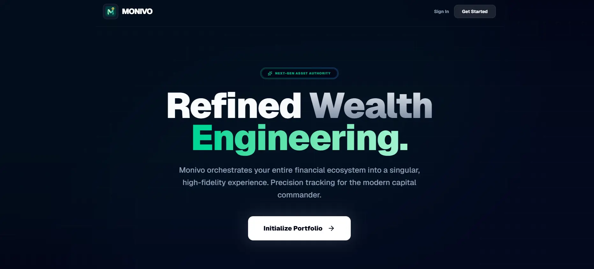
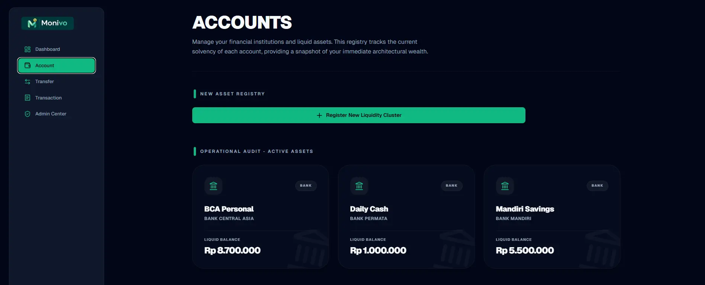
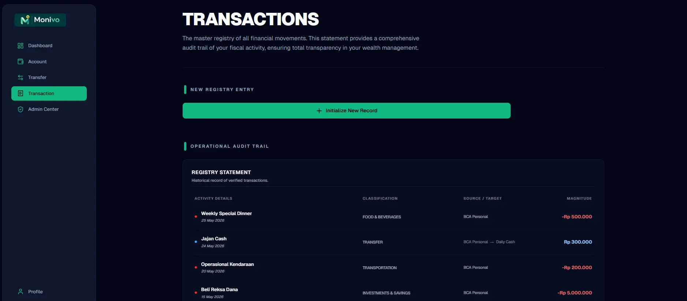

# 💎 Monivo — Unified Personal Finance Management

> A modern full stack financial management platform that helps users monitor assets, track transactions, and gain meaningful insights into their financial health.



---

## 📖 Overview

Managing personal finances is often more complicated than it should be.

Most people keep their money across multiple bank accounts, digital wallets, cash, and investments. As financial activities grow, it becomes increasingly difficult to understand where money comes from, where it goes, and how overall wealth changes over time.

While spreadsheets offer flexibility, they require manual work. Many finance applications only focus on budgeting or expense tracking, leaving users without a complete picture of their financial portfolio.

**Monivo** was built to solve this problem by providing a centralized financial dashboard where users can manage accounts, record transactions, monitor balances, and analyze spending habits—all within a clean, responsive, and intuitive interface.

---

# ✨ Key Features

## 📊 Financial Dashboard

A centralized overview of your financial health.

- Total asset overview
- Net worth calculation
- Monthly financial summary
- Recent activity timeline
- Beautiful data visualizations

---

## 💳 Account Management

Organize all your financial accounts in one place.

- Multiple account support
- Current balance tracking
- Account statistics
- Individual account history

---

## 💸 Transaction Management

Keep every financial movement organized.

- Record income and expenses
- Categorize transactions
- Search and filter history
- Edit or delete transactions
- Chronological transaction timeline

---

## 📈 Financial Insights

Understand your spending patterns through interactive analytics.

- Income vs Expense comparison
- Spending by category
- Monthly trends
- Financial summaries
- Interactive charts

---

## 🔐 Secure Authentication

Security is a core part of the application.

- JWT based authentication
- Protected routes
- Secure session handling
- User specific financial data

---

## 🎨 Modern User Experience

Designed with both aesthetics and usability in mind.

- Responsive layout
- Smooth animations
- Modern glassmorphism UI
- Dark elegant color palette
- Mobile friendly interface

---

# 📸 Screenshots

<div align="center">

### 🏠 Landing Page


### 🔑 Authentication



### 📊 Dashboard



### 🏦 Accounts



### 💸 Transactions



</div>

---

# 🏗 Architecture

Monivo follows a modern full stack architecture using the latest Next.js App Router.

```
Client
      │
      ▼
 Next.js App Router
      │
      ▼
Authentication (JWT)
      │
      ▼
API Routes
      │
      ▼
PostgreSQL Database
```

The project emphasizes:

- Scalable folder structure
- Reusable UI components
- Separation of server and client logic
- Responsive design
- Performance focused rendering

---

# 🛠 Tech Stack

| Category       | Technology              |
| -------------- | ----------------------- |
| Framework      | Next.js 15 (App Router) |
| Language       | TypeScript              |
| Styling        | Tailwind CSS v4         |
| Animation      | Framer Motion           |
| Database       | PostgreSQL              |
| Authentication | JWT                     |
| Charts         | Recharts                |
| Icons          | Lucide React            |

---

# 🚀 Getting Started

## 1. Clone the repository

```bash
git clone https://github.com/bransyahtan/monivo.git
```

## 2. Install dependencies

```bash
npm install
```

## 3. Configure environment variables

Create a `.env` file based on:

```bash
.env.example
```

Fill in the required database credentials and JWT secret.

---

## 4. Run development server

```bash
npm run dev
```

---

## 5. Open your browser

```
http://localhost:3000
```

---

# 📂 Project Structure

```
src/
├── app/
├── components/
├── lib/
├── hooks/
├── services/
└── types/
```

---

# 🚧 Challenges

Building Monivo involved solving several engineering challenges:

- Designing reusable financial data models
- Managing authenticated user sessions
- Building responsive dashboards
- Creating reusable chart components
- Organizing scalable application architecture
- Maintaining a consistent UI system
- Optimizing data fetching for dashboard statistics

---

# 🎯 Future Improvements

- [ ] Budget planning
- [ ] Savings goals
- [ ] Investment portfolio
- [ ] Recurring transactions
- [ ] CSV import/export
- [ ] Multi currency support
- [ ] Notifications
- [ ] Data backup & restore

---

# 💡 Why I Built This

Monivo started as a personal project to practice building a production style full stack application using modern web technologies.

Rather than creating another CRUD application, I wanted to build something that resembles a real world SaaS product one that combines authentication, database management, analytics, interactive dashboards, responsive design, and thoughtful user experience.

The project focuses not only on functionality but also on creating a polished interface that users would genuinely enjoy using.

---

# 🤝 Contributing

Contributions, suggestions, and feedback are always welcome.

Feel free to fork the repository and submit a pull request.

---

# 👨‍💻 Author

**Sultan Bransyah**

Built using Next.js, TypeScript, and Tailwind CSS.
